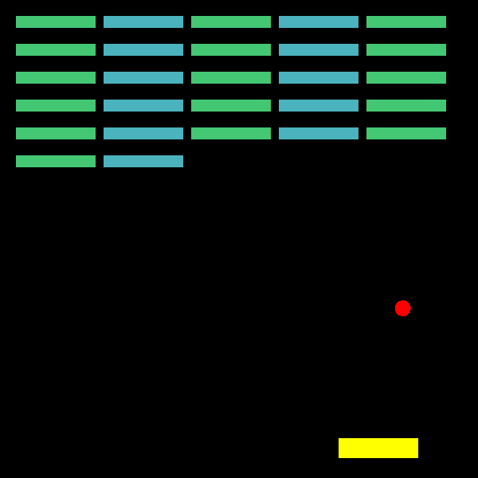
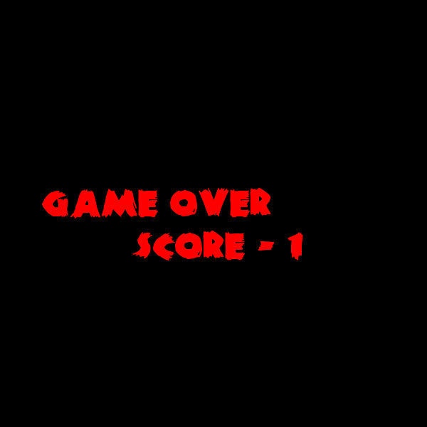

# Brick Blast
2D Game Using C++ Library SFML
## Prerequisites

Install SFML in Linux.

```bash
sudo apt-get install libsfml-dev

```

## Usage

### Linux
#### In Terminal Navigate To Game Folder
```bash
./build.sh
```

## Screenshots




## Contributing
Pull requests are welcome. For major changes, please open an issue first to discuss what you would like to change.
## Contact

Aditya Walia - adi.walia16@gmail.com
